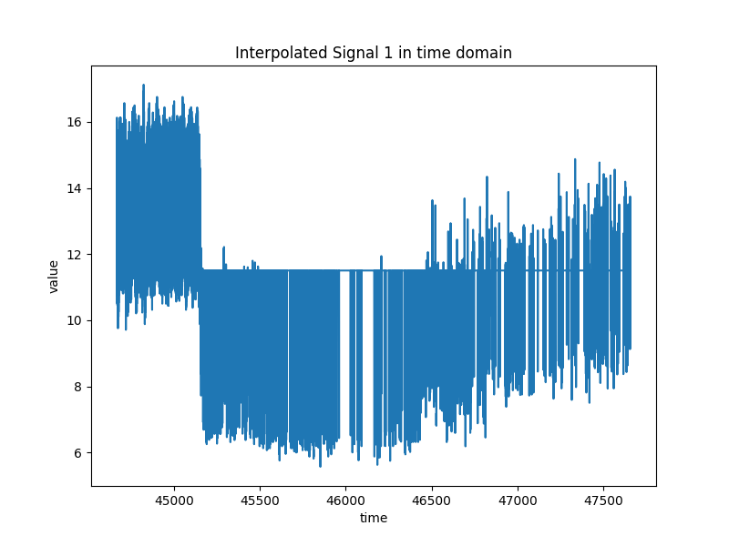
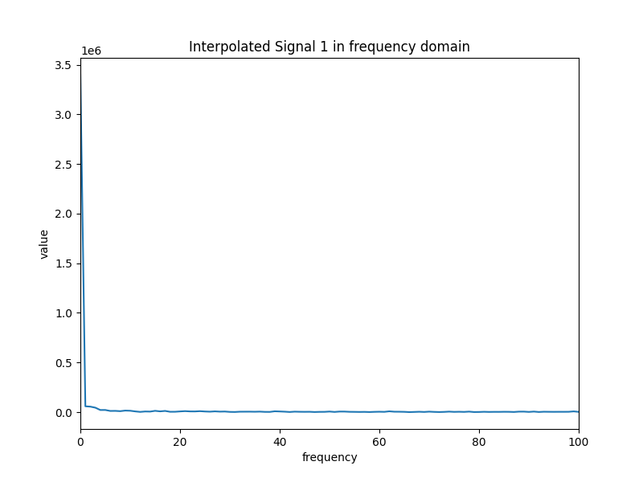
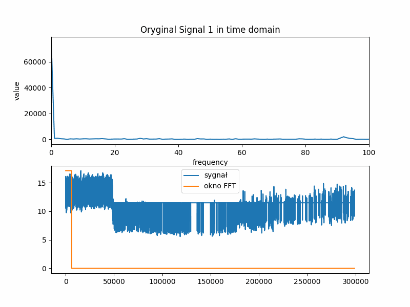
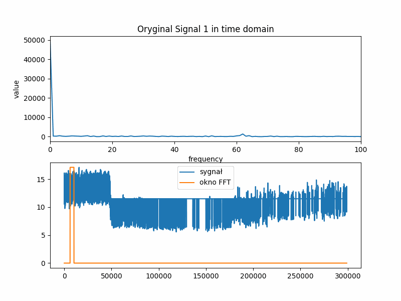

> [!NOTE]
> Joint analysis of slow waves and pulse waveform of intracranial pressure

# Project Description

This Python project processes signals stored in a .pkl file, interpolates them to a specified sampling frequency, and then displays both the time-domain signal and its frequency spectrum. 

> [!IMPORTANT]
> The file I worked on, "2aHc688_ICP.pkl," contains 172 signals and is too large to share on GitHub. To obtain the .pkl file, please contact the author of the work.

## Project dependencies
The project uses the:
 - pickle, 
 - PIL, 
 - matplotlib, 
 - numpy.

You can install the missing libraries using pip:
```sh
pip install matplotlib numpy
```

## Usage Instructions

Make sure you have the file 2aHc688_ICP.pkl in the data directory.
Run the Python script:
```sh
python main.py
```

## Script Description

<strong>1.  Loading Data</strong>

The script loads data from the 2aHc688_ICP.pkl file using the pickle library.


<strong>2. Signal Processing: </strong>

It retrieves:
 - signal data, 
 - sampling frequency,
 - error flag,
 - start time.

Calculates the sampling period and creates time arrays for the original and interpolated signals. 
Interpolates the signal to the desired sampling frequency (100 Hz).
Performs a Fourier transform on the interpolated signal.

This project shows three different types of signal processing:
- `classic FFT` - code calculates the sampling period and creates time arrays for the original and interpolated signals. Interpolates the signal to the desired sampling frequency (100 Hz). Performs a Fourier transform on the entire interpolated signal.
- `windowed FFT` - code creates window of fixed size and walks it over signal with given step size. On each window FFT transform is performed.
- `adaptive window FFT` - code creates window which width is dependent on signal in window in previous iteration. Window is defined by it's max and min values. It width is dependent on signal energy which is calculated as follows:
    $$
    E = \sum_{n=1}^{N}{(x_n)^2}
    $$
    Were:
    - $E$ - total signal energy
    - $N$ - is number of values in signal
    - $x_n$ - n-th value in signal

    When energy of signal in current window is greater than 105% of previous window energy, then window size is set to 80% of previous window size. When energy of signal in current window is smaller than 95% of previous window energy, then window size is set to 120% of previous window size. 

<strong> 3. Visualization</strong>

Plots the original time-domain signal.


Plots the interpolated time-domain signal.


Plots the magnitude of the Fourier transform of the interpolated signal in the frequency domain.


Creates animation of changes of windowed FFT for each window  


Creates animation of changes of adaptive windowed FFT for each window  

